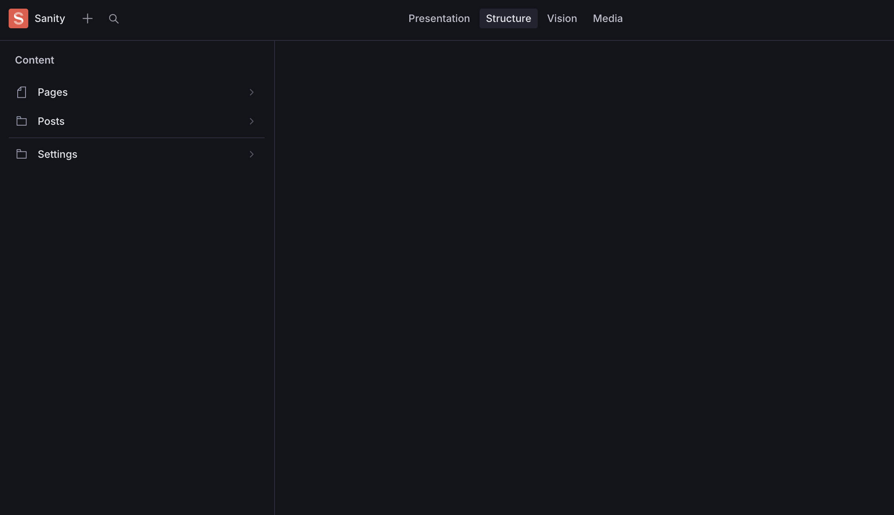

# Next.js Monorepo with Sanity CMS

A full-stack template built with:

- TypeScript
- Next.js
- Sanity
- Storybook
- Vitest
- Turborepo
- Tailwind CSS
- Biome



## Requirements

- Node >= 22.14.0
- PNPM >= 10.6.1

## Installation

1. Clone the repository

```bash
git clone git@github.com:vueza/create-sanity-app.git
```

2. Setup environment variables

```bash
cp apps/cms/.env.example apps/cms/.env
cp apps/docs/.env.example apps/docs/.env
cp apps/web/.env.example apps/web/.env
```

3. Install dependencies

```bash
pnpm install
```

4. Run development

```bash
pnpm dev
```

## Commands

- `pnpm build`: Builds the project using Turbo
- `pnpm check-types`: Runs type checking across the project
- `pnpm clean`: Removes build artifacts, Turbo cache, and node modules
- `pnpm coverage`: Runs test coverage report
- `pnpm dev`: Starts development server
- `pnpm editorconfig-checker`: Checks EditorConfig file formatting
- `pnpm lint`: Runs Biome code linting
- `pnpm preinstall`: Ensures pnpm is used as the package manager
- `pnpm prepare`: Installs Git hooks via Lefthook
- `pnpm syncpack-fix-mismatches`: Fixes package dependency mismatches
- `pnpm syncpack-format`: Formats package configuration
- `pnpm syncpack-lint`: Lints package configuration
- `pnpm syncpack-update`: Updates package dependencies
- `pnpm test`: Runs test suite
- `pnpm ui`: Runs tests in interactive UI mode with watch
- `pnpm gen component`: Creates a Sanity schema, Storybook component and React
  UI component

## Structure

### Apps

- `apps/cms`: Sanity Studio
- `apps/docs`: Storybook
- `apps/web`: Next.js

### Packages

- `packages/config-tailwind`: Shared Tailwind CSS configuration
- `packages/config-typescript`: Shared TypeScript configuration
- `packages/internalization`: Internationalization
- `packages/migration`: Migration
- `packages/ui`: Shared React UI component library

## Local Development

- Storybook - [http://localhost:6006](http://localhost:6006)
- Web - [http://localhost:3000](http://localhost:3000)
- Sanity - [http://localhost:3333](http://localhost:3333)
